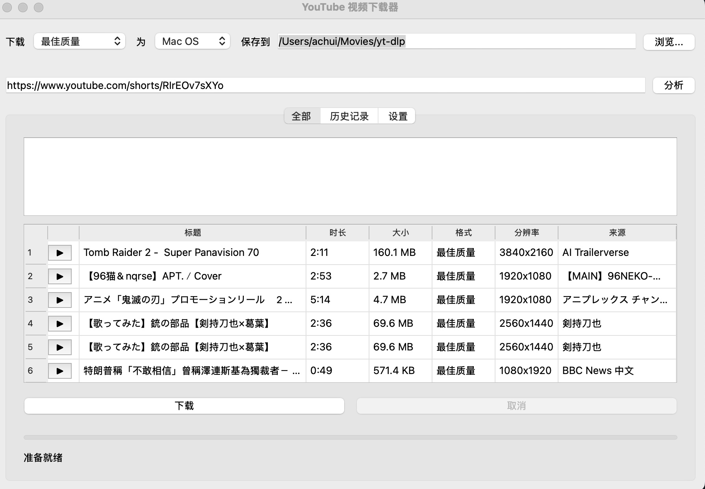
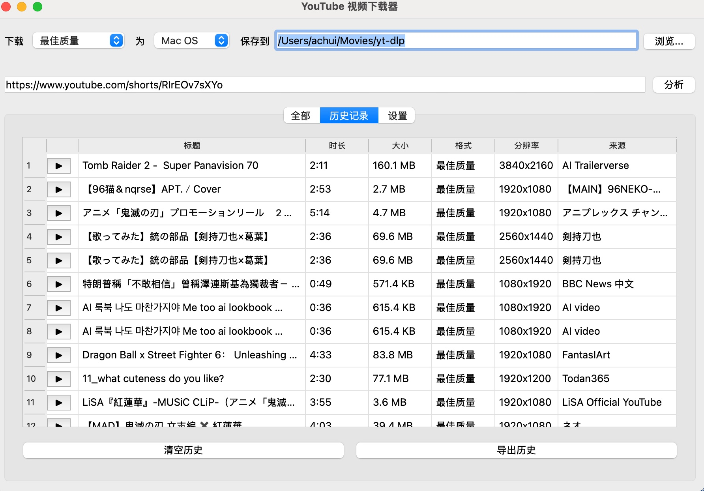
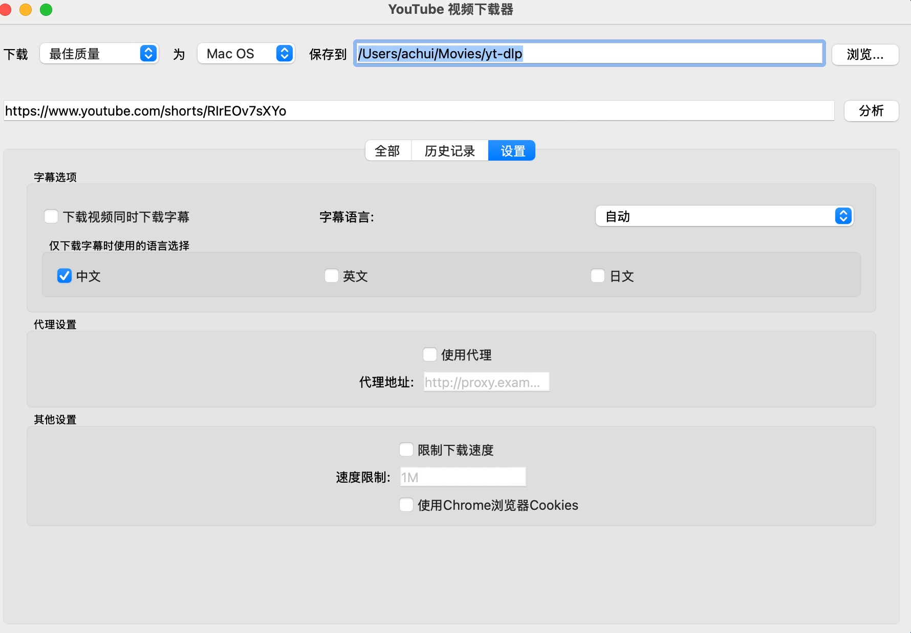

# YouTube视频下载器

一个基于Python和PyQt6的YouTube视频下载工具，支持多种格式和分辨率的视频下载。

## 功能特点

- 支持下载YouTube视频、音频和字幕
- 支持多种视频格式和分辨率选择
- 支持下载历史记录管理
- 支持代理设置和下载速度限制
- 支持使用Chrome浏览器Cookies下载需要登录的视频

## 安装要求

- Python 3.12+
- PyQt6
- yt-dlp

## 安装步骤

1. 克隆仓库

```bash
git clone https://github.com/你的用户名/youtube-downloader.git
cd youtube-downloader
```

2. 安装依赖

```bash
pip install -r requirements.txt
```

3. 运行程序
```bash
python main.py
```

## 使用说明

1. 输入YouTube视频链接或粘贴到输入框中
2. 点击"分析"按钮获取视频信息
3. 选择下载格式和保存位置
4. 点击"下载"按钮开始下载

## TODO List

- [X] 下载youtube视频
- [X] 浏览器插件联动
- [X] 字幕下载
- [ ] 启动时也将API服务启动起来，可以结合plugin使用
- [ ] 引入Duckdb做为数据库，用于记录下载历史
- [ ] 删除历史记录可以批量删除，并且删掉对应的文件和字幕
- [ ] 浏览器插件，可以显示下载日志

## 截图


