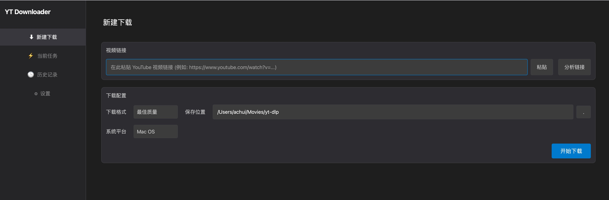
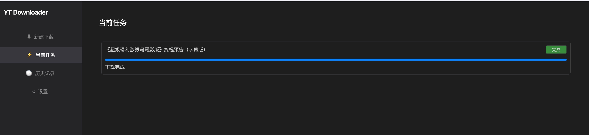
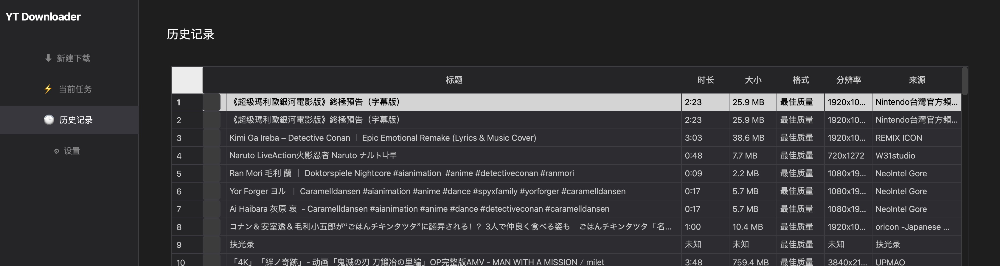
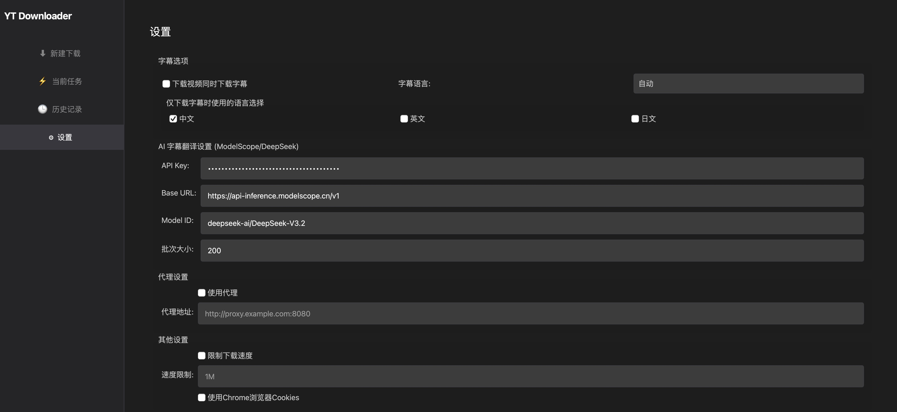

# YouTube视频下载器

一个基于 Python 3.12+ 和 PyQt6 的现代化 YouTube 视频下载工具，支持多种格式、AI字幕翻译、语音识别生成字幕，以及浏览器插件快速下载。

## 功能特点

### 核心下载
- 支持下载 YouTube 视频、音频和字幕
- 多种格式选择：最佳质量、仅视频、仅音频(MP3)、1080p/720p/480p/360p
- 多任务并发下载，实时进度跟踪
- 下载速度限制、代理支持
- 使用 Chrome 浏览器 Cookies 下载需要登录的视频

### 字幕管理
- 下载视频字幕（支持自动字幕）
- AI 翻译字幕（基于 ModelScope/DeepSeek V3，流式响应）
- FFmpeg 字幕合成（将字幕嵌入视频）
- Whisper 语音识别生成字幕

### 浏览器插件
- Chrome 扩展（Manifest V3）
- 右键菜单快速下载
- 支持选择格式：最佳质量、MP3、1080p

### 历史与配置
- 下载历史记录管理（JSON持久化）
- 导出历史为 CSV 文件
- 配置持久化到 config.json

## 技术栈

| 组件 | 技术 |
|------|------|
| GUI框架 | PyQt6 + QSS深色主题 |
| 下载引擎 | yt-dlp |
| API服务 | FastAPI + Uvicorn |
| AI翻译 | OpenAI SDK (兼容 DeepSeek/ModelScope) |
| 语音识别 | Whisper |
| 日志 | Loguru |
| 构建 | PyInstaller |

## 安装要求

- Python 3.12+
- PyQt6 >= 6.8.1
- yt-dlp >= 2026.3.17
- FFmpeg（用于字幕合成）

## 安装步骤

1. 克隆仓库

```bash
git clone https://github.com/你的用户名/youtube-downloader.git
cd youtube-downloader
```

2. 安装依赖

```bash
pip install -r requirements.txt
```

3. 安装 FFmpeg（macOS）

```bash
brew install ffmpeg
```

## 快速开始

### 运行主程序

```bash
python main.py
```

### 启动 API 服务器（供浏览器插件使用）

```bash
python api_server.py
```

API 服务运行在 `http://127.0.0.1:8765`

### 打包为可执行文件

```bash
python build_exe.py
```

打包后的文件位于 `dist/` 目录

## 使用说明

### 桌面应用

1. 输入 YouTube 视频链接或点击"粘贴"按钮
2. 点击"分析链接"获取视频信息
3. 选择下载格式和保存位置
4. 可选：勾选"下载视频同时下载字幕"并选择语言
5. 点击"开始下载"

### 浏览器插件

1. 安装 Chrome 扩展（将 `chrome-plugin` 目录加载为扩展程序）
2. 在 YouTube 页面右键点击，选择下载选项
3. 或点击扩展图标选择格式快速下载

### AI 字幕翻译

1. 在历史记录中右键点击项目
2. 选择"AI 翻译字幕..."
3. 选择要翻译的 SRT 文件
4. 翻译完成后自动保存为 `xxx_zh.srt`

### 生成字幕

1. 在历史记录中右键点击视频项目
2. 选择"生成字幕..."
3. 选择语言并确认
4. 使用 Whisper AI 自动生成字幕文件

## 项目结构

```
video-downloader/
├── main.py                    # 应用程序入口
├── ui.py                      # 主窗口UI实现
├── api_server.py              # FastAPI服务器
├── download_manager.py         # 下载配置管理（单例模式）
├── download_thread.py          # 下载/分析线程（QThread）
├── ai_translator.py           # AI字幕翻译（流式响应）
├── whisper_service.py         # Whisper语音识别服务
├── whisper_thread.py          # Whisper后台线程
├── subtitle_merger.py         # FFmpeg字幕合成
├── history_manager.py         # 历史记录管理
├── config.py                  # 配置管理
├── styles.py                  # QSS深色主题样式
├── utils.py                   # 工具函数
├── my_logger.py               # 日志封装
├── custom_events.py           # 自定义Qt事件
├── task_widget.py             # 下载任务UI组件
├── translation_dialog.py      # 翻译进度对话框
├── generate_subtitle_dialog.py # 生成字幕对话框
├── tabs/                      # UI标签页
│   ├── history_tab.py         # 历史记录标签
│   └── settings_tab.py        # 设置标签
└── chrome-plugin/             # Chrome扩展
    ├── manifest.json
    ├── background.js
    ├── popup.html
    └── popup.js
```

## 配置说明

配置文件位于 `config.json`，首次运行自动生成。

主要配置项：

```json
{
    "subtitle": {
        "enabled": false,
        "language": "自动"
    },
    "ai_translator": {
        "api_key": "",
        "base_url": "https://api-inference.modelscope.cn/v1",
        "model": "deepseek-ai/DeepSeek-V3.2",
        "batch_size": "200"
    },
    "proxy": {
        "enabled": false,
        "url": ""
    },
    "other": {
        "limit_speed": false,
        "limit_rate": "",
        "chrome_cookies": false
    }
}
```

## 开发指南

### 代码规范

- 文件头部包含 shebang 和编码声明
- 导入顺序：标准库 → 第三方库 → 本地模块
- 命名：CamelCase（类名）、snake_case（函数/变量）、UPPER_SNAKE_CASE（常量）
- Qt 信号使用 snake_case 命名
- 使用 QThread 处理后台任务，避免阻塞UI
- 使用 try/except 捕获具体异常，避免裸 except

详见 [AGENTS.md](./AGENTS.md)

## TODO List

- [X] 下载 YouTube 视频
- [X] 浏览器插件联动
- [X] 字幕下载
- [X] AI 字幕翻译
- [X] Whisper 生成字幕
- [ ] 启动时自动启动 API 服务
- [ ] 引入 DuckDB 作为数据库记录下载历史
- [ ] 批量删除历史记录及对应文件
- [ ] 浏览器插件显示下载日志

## 截图





